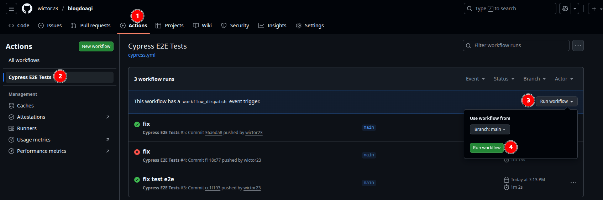

🧪 Automação de Testes – Blog Agibank

Cypress + BDD (Gherkin)

    Este repositório contém a automação de testes funcionais do Blog Agibank, utilizando Cypress com abordagem BDD (Behavior Driven Development).
    O objetivo é validar fluxos essenciais do blog, como acesso a posts e busca por palavras-chave.

📌 Tecnologias Utilizadas

    Node.js
    Cypress
    Cypress Cucumber Preprocessor
    JavaScript
    Gherkin (BDD)
    GitHub Actions (CI/CD)

🧠 Abordagem de Teste

    Testes funcionais
    Escrita dos cenários em BDD (Given / When / Then)
    Separação clara entre:
    Features (.feature)
    Step Definitions
    Commands reutilizáveis

🚀 Pipeline CI/CD (GitHub Actions)

Este projeto possui uma pipeline configurada no GitHub Actions, que executa os testes automaticamente.

▶️ Trigger manual da pipeline

    A pipeline pode ser executada manualmente através de um botão:
    Acesse o repositório no GitHub
    Clique em Actions
    Selecione o workflow Cypress Tests
    Clique em Run workflow
    Confirme a execução
    Isso permite que o avaliador execute os testes sem rodar nada localmente.



✅ Pré-requisitos (Linux e Windows)

Antes de iniciar, é necessário ter instalado:

Node.js Versão 18 ou superior
👉 https://nodejs.org

Navegador Google Chrome ou Edge

🔍 Verificando versões

    node -v
    npm -v
    git --version

▶️ Como rodar o projeto localmente
1️⃣ Clonar o repositório

```bash
git clone https://github.com/wictor23/blogdoagi.git
cd blogdoagi
```

2️⃣ Instalar as dependências

```bash
npm install
```
🧪 Executando os testes
🔹 Abrir o Cypress (modo interativo)

Funciona igual no Linux e no Windows:

```bash
npx cypress open
```
Depois:

Selecione E2E Testing
Escolha o navegador
Clique no cenário desejado


